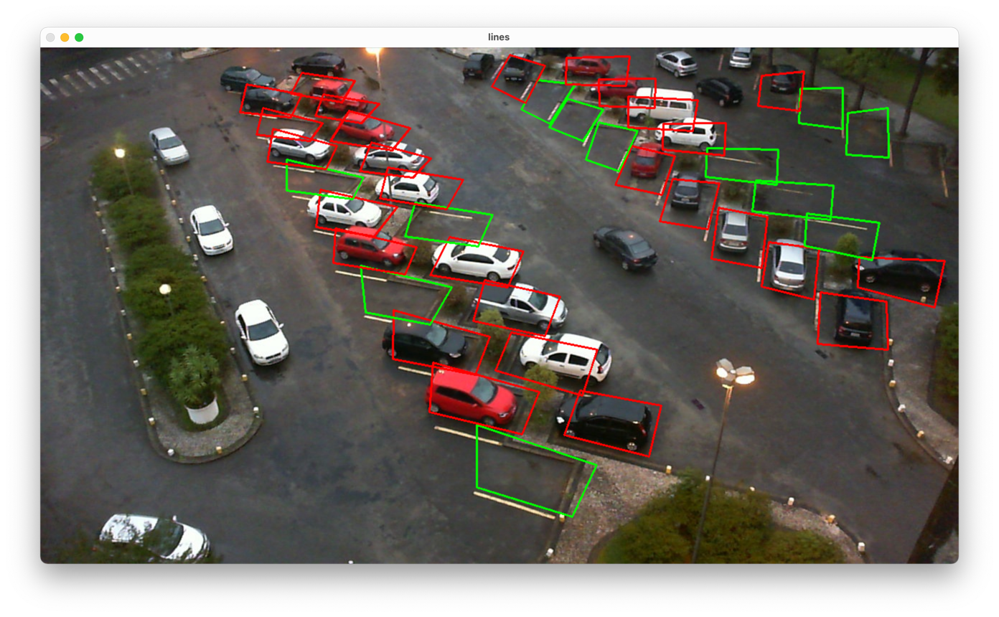
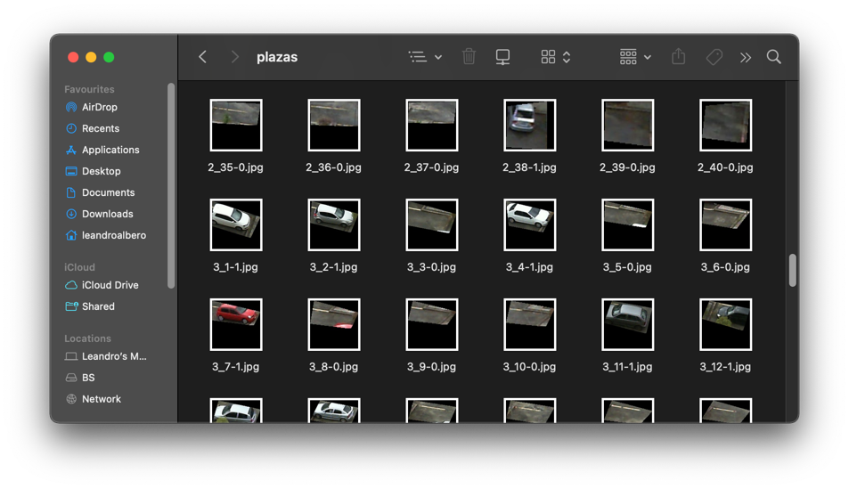

# parking_cv
Parking_cv is a machine learning project that uses a Mini Xception DNN on Keras and Tensorflow to classify images extracted 
from a parking lot camera. It also uses OpenCV to handle image processing and display. 

For more info please check the GitHub Wiki.


## Install requirements
```
pip3 install -r requirements.txt
```

## Usage

You can either use input arguments to the program or disable input arguments and use methods by yourself as explained
in next sections.
```
usage: main.py [-h] --mode MODE [--image IMAGE] [--parking PARKING] [--model MODEL] [--train_dataset TRAIN_DATASET]

optional arguments:
  -h, --help            show this help message and exit
  --mode MODE           image, train or segment
  --image IMAGE         Route to the image
  --parking PARKING     Route to the parking .xml containing state
  --model MODEL         Route to DNN model.h5
  --raw_dataset RAW_DATASET
                        Route to the whole dataset (PKLot without segmenting)
```
For example, if you want to **extract all the patches from the PKLot database** to later train the DNN:
```
python3 main.py --mode segment --raw_dataset ./PKLot/PKLot
```
Train a DNN
```
python3 main.py --mode train
```
Load a parking lot image and infer its status
```
python3 main.py --mode image --image samples/2012-10-31_07_43_02.jpg --parking samples/2012-10-31_07_43_02.xml
```
Create a new parking lot from an image and set its parking spot coordinates
```
python3 main.py --mode create --image samples/2012-10-31_07_43_02.jpg --parking demo1.xml
```

## How to train the DNN
First we need to traverse all the folders inside the PKLot database
(https://web.inf.ufpr.br/vri/databases/parking-lot-database/) to generate the 150x150 crops needed to train the DNN:


```traverse_and_segment('route_to_PKLot_root')``` 

This will extract all the parking spaces inside each of the pictures and fit them onto frames like in the picture below:

Each file has the following naming scheme: `parking_lot_id`_`place_id`-`status`.jpg and it is stored inside the "plazas"
folder.

Once finished we will need to train the neural network on the pictures we have just extracted (723790 parking spots), 
we do so by issuing the following command:
```
train.start()
```

This will take hours or minutes depending on your hardware (Training on an 12 thread, i7 8750H took 2 days), 
when finished it will generate a file named 'model.h5'. If you want you can download my trained model and save it in the
content root: 
https://drive.google.com/file/d/1ubyPzxLrnnSU6aR1Tmo8UcY2Wo4kDmIK/view?usp=sharing


## Create a parking lot instance from an image
If we don't have the .xml file for the parking lot we are going to use we can generate one by issuing the following
command:
```
p1 = Parking("demo1.xml", image="PKLot/PKLot/UFPR05/Sunny/2013-03-12/2013-03-12_07_30_01.jpg")
```
This will open a window with the image you have selected. Next step is to click on each parking spot to define its four
edges. Left click will define the parking spot as 'occupied', right click will define it as 'free'. 

Repeat for each parking spot you want to classify and middle click to update the preview. Once finished you can press 
any key to save the file as an .xml, following is an example of an .xml with an unique parking spot:
```
<parking id="demo1.xml">
    <space id="0" occupied="True">
        <contour>
            <point x="425" y="366" />
            <point x="520" y="381" />
            <point x="556" y="340" />
            <point x="422" y="319" />
        </contour>
    </space>
</parking>
```

## Load an existing parking lot from an .xml file

We then need to spawn a parking instance by using the coordinates of an existing parking lot:
```
p1 = Parking("PKLot/PKLot/UFPR05/Rainy/2013-03-13/2013-03-13_13_05_08.xml", image="PKLot/PKLot/UFPR05/Sunny/2013-03-12/2013-03-12_07_30_01.jpg")
```

## Update an existing parking lot status with a new image 
To update all of the parking spots on a parking lot we will need to first load the parking lot and issue the 
update_state_from_photo command.
This command internally calls a routine that splits the image into the parking spots defined in the .xml file and saves
their 150x150 crop into a 'temp' folder.

Once these files have been created, it feeds them into the DNN and infers their status.
```
p1.update_state_from_photo("PKLot/PKLot/UFPR05/Sunny/2013-03-12/2013-03-12_08_40_03.jpg")
```
This will ONLY update the running instance's status, not the file. To update the contents of the .xml file we will need to:
```
p1.save_state("demo1.xml")
```
Or issue the following commands to show the image (saves status when pressing any key):
```
p1.draw_boxes()
cv2.waitKey(0)
```
## Folder structure
```
|––– PKLot                  # Dataset used to train DNN with +95% accuracy
     |––– PKLot
          |––– PUCPR
               |––– Cloudy
                    |––– 2012-09-12
                        |––– 2012-09-12_06_05_16.jpg
                        |––– 2012-09-12_06_05_16.xml
                        ...
                    ...
               |––– Rainy
               |––– Sunny
          |––– UFPR04
                ...
          |––– UFPR05
                ...
|––– plazas                 # Where 150x150 px patches are saved after calling traverse_and_segment()
|––– samples                # Contains samples of the PKLot dataset
|––– temp                   # Contains patches used by update_state_from_photo()
|––– demo1.xml              # Sample of a file containing whole parking status
|––– main.py
|––– predict.py             # Code to predict either by whole parking (taking input from "./temp" folder) or by patch
|––– train.py               # Mini XCeption implementation
```
## References
Parking Lot Database [https://web.inf.ufpr.br/vri/databases/parking-lot-database/](https://web.inf.ufpr.br/vri/databases/parking-lot-database/)

PKLot - A robust dataset for parking lot classification [https://www.inf.ufpr.br/lesoliveira/download/pklot-readme.pdf](https://www.inf.ufpr.br/lesoliveira/download/pklot-readme.pdf)
 ...